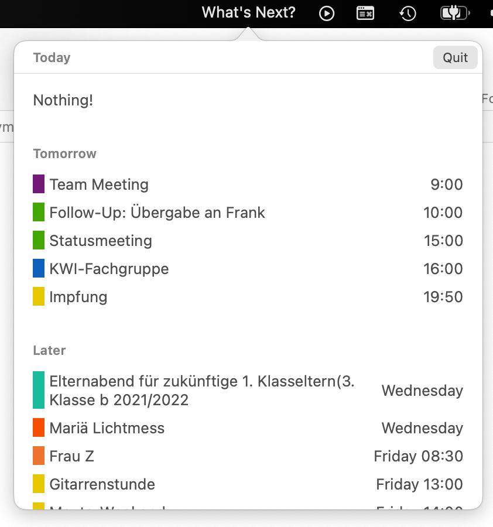

# What's Next

A small utility app for macOS using SwiftUI and `EventKit` to show your upcoming calendar appointments in menubar popover.  
Implemented along the [HWS+](https://www.hackingwithswift.com/plus/) live stream by Paul Hudson.

## Features

- Adding a custom button to the system menu bar section (on the right side) which is always accessible
- Showing a popover with our SwiftUI view when the menu bar entry was pressed. (using old-style AppKit target-action)
- Monitoring the mouse down events to close the popover when the user interacts with other apps.
- Requesting permission to access the users calendar and querying the upcoming calendar appointments using `EventKit`

## Screenshots

